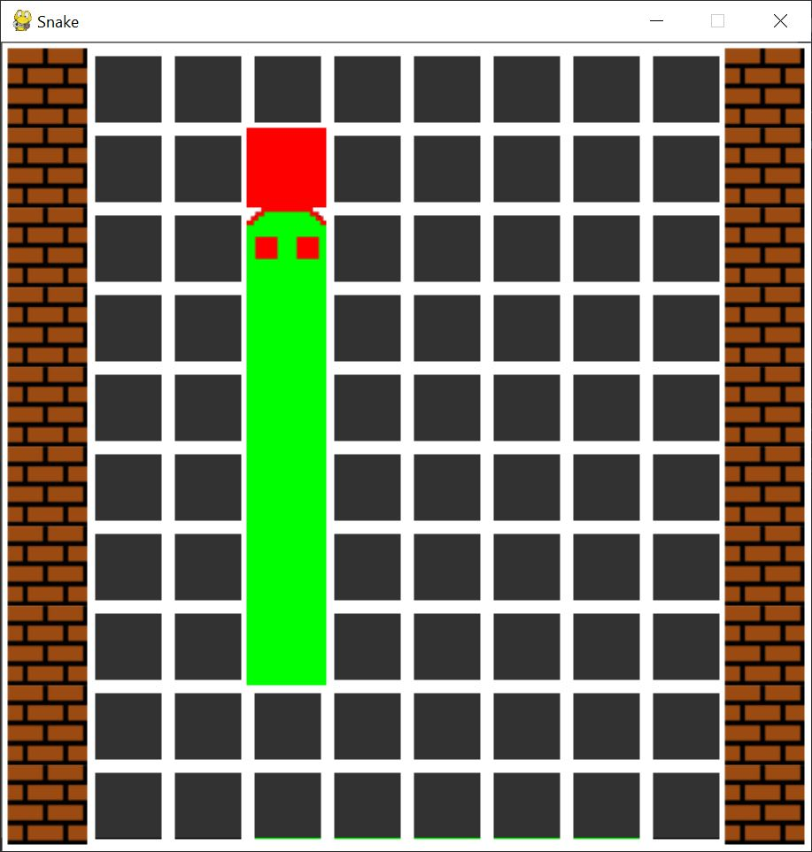

# Snake
*_this version of snake was made for my educational training purposes_

*_there is a bug when you fill the whole grid with your snake and win_

# How to install

## Option 1) Install the source code and the requirements
#### Step 1) Install from source code
You can obtain the source code by one of two methods
#### Method 1) Install source snapshot
Install a compressed archive of the source code folder at the latest revision on GitHub  [here](https://github.com/MohHossary/Snake/archive/refs/heads/master.zip)

#### Method 2) Clone the repository
run this command in the terminal
```shell
git clone https://github.com/MohHossary/Snake.git
```
to create a local clone of the repository.
#### Step 2)

Run the command
```shell
pip install -r requirements.txt
```
in the terminal to install the required packages.
 
## Option 2) Install the binary file

Download the binary file from [here](https://github.com/MohHossary/Snake/releases/latest) and unpack it

# How to run

- If you installed the source code, run this command in this same Snake folder
```shell
python run.py
```
You may be able to run the game by simply double-clicking the `run.py` file instead, if you have your system configured to run python files directly.

- If you downloaded the binary, then double-click the executable file `Snake.exe` to start playing

# How to play
Use the arrow keys to move the head of the snake to eat (collide with) the fruit.
Each time the snake eats a fruit the snake gets longer and the tick speed of the game becomes 19/20 the original tick speed
There are four modes for walls selected randomly each game
1. No walls. In this mode, you will not see a brick pattern around the edge of the grid, so if you go to the edge of the map vertically, *or* horizontally you will warp to the other side (left to right and vice versa and up to down and vice versa)
2. Horizontal walls. In this mode you will see two lines of brick patterns placed horizontally at the top and bottom of the grid, so you can only warp horizontally
3. Vertical Walls. In this mode you will see two vertical lines of brick patterns placed on the left and right of the grid, so you can only warp vertically
4. All walls. In this mode you will see brick patterns on all the edges of the map, so you cannot warp


Have fun :-)


# Some Screenshots

<table>
  <tr>
    <td> 
      
    </td>
    <td>
      
    </td>
    <td> 
      
  </td>
</tr>
</table>
